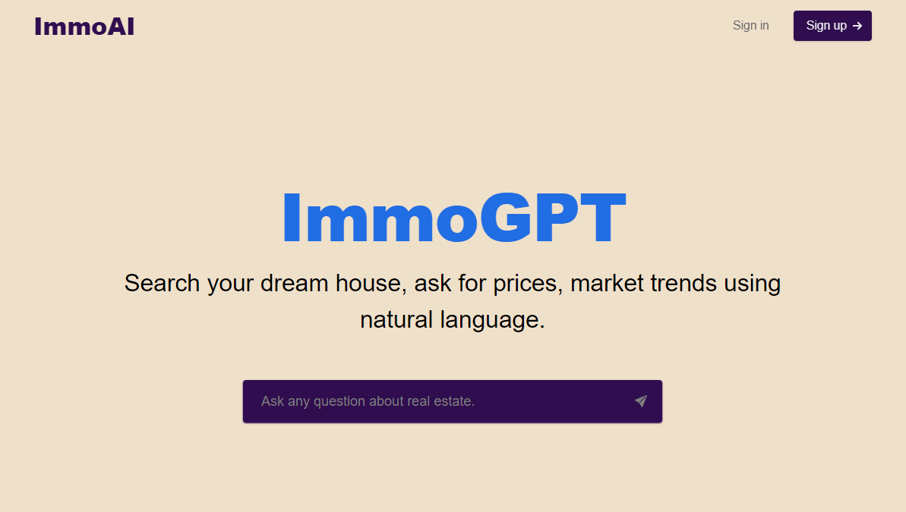

# ImmoAI
ImmoAI aims to help you search you dream house 🏠, do real estate market research using natural language. it's accessible via this link [immo.ai](http://localhost:3000/).

## Requirements 
1) You need to have OPENAI_API_KEY, PINECONE_API_KEY, PINECONE_ENV. You need to create a file .env and put the keys there.
2) AWS CLI configured.
3) Ask to get access to the data.
   
## Getting Started
### Installation
------------

    $ git clone https://github.com/abdel-ely-ds/immoAI-service.git
    $ cd immoai-service
    
### Run the service
------------
    $ pip install -e .
    $ uvicorn immo.app:app

### Run with Docker
------------
    $ docker-compose up
    
## RoadMap
1) Add visualization.
2) Possibility to visualize the relationship between price and some other variables.
3) Add dashboard to give a global overwiew of the market.
